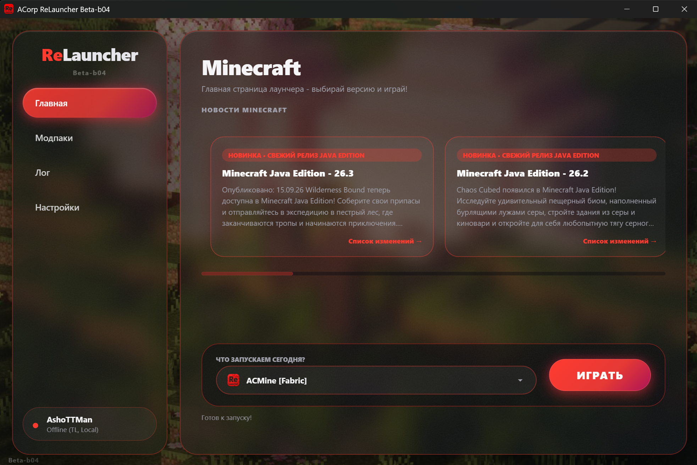
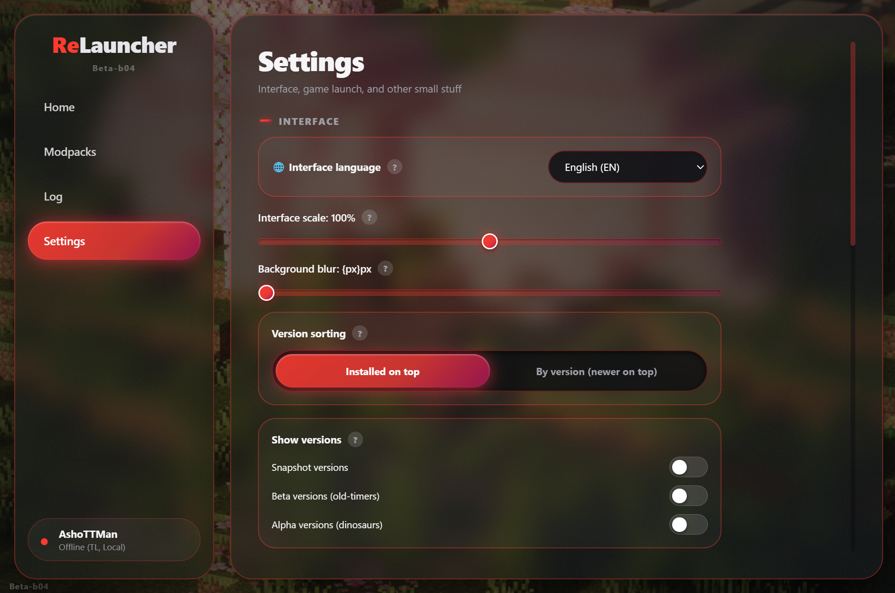

# ReLauncher

**Современный, быстрый и визуально приятный лаунчер Minecraft**

 

 

[ Скачать установщик (Releases) ](https://github.com/AshoTTMan/ReLauncher/releases) • [ Сообщить о баге ](https://github.com/issues) • [ Настройки ](#️-параметры-и-настройки) • [ Скины ](#-система-скинов)

---

## 📸 Галерея

### 🎮 Главный экран

Быстрый запуск, маркировка версий (R — релизы, S — снапшоты, B — бета, A — альфа) и поле поиска.

 

### 📦 Система модпаков

- **Установка в один клик:** просто перетащите файл `.mrpack` (Drag & Drop) в лаунчер.
- **Экспорт:** сохраняйте свои сборки обратно в `.mrpack` через контекстное меню.
- **Полная изоляция:** модпаки хранятся в `.relauncher\versions\ваши_модпаки`, каждый экземпляр имеет свою изолированную папку `mods` и конфиги.
- **Поддержка загрузчиков:** Fabric, Forge, NeoForge, Quilt.

 

### ⚙️ Тонкие настройки клиента

Широкие возможности персонализации игрового процесса и самого лаунчера.

---

## ⚙️ Параметры и настройки

Лаунчер содержит много настроек для вас:

- 🎮 **Размер окна игры** — Укажите размер окна и игра запуститься именно с этим размером.
- 🖥️ **Запуск в полный экран** — переключение игры в полноценный полноэкранный режим (Fullscreen) при старте.
- 🧠 **Выделение памяти** — ползунок настройки оперативной памяти (ОЗУ / RAM) для плавной работы тяжелых сборок.
- ☕ **Пользовательская Java** — возможность указать собственный путь к JDK (По умолчанию - автовыбор/автоустановка).
- ⚡ **Параметры запуска JVM** — тонкая передача пользовательских аргументов для JVM.
- 📁 **Расположение папки с игрой** — укажите путь куда хотите переместить папку с версиями игры `.relauncher` 
- ⏭️ **Пропуск начальной настройки** — пропускает приветственное меню при первом запуске Minecraft.
- 🔍 **Масштаб лаунчера (UI Scale)** — адаптация интерфейса под ваш монитор.
- 🌐 **Языки** — переключение языка интерфейса лаунчера:
  - 🇷🇺 Русский
  - 🇬🇧 English
  - 🇨🇳 简体中文
- 📥 **Скрытие в трей** — аккуратное сворачивание программы в системный трей при запуске игры.

---

## 👤 Система скинов

В лаунчер интегрирован удобный переключатель скинов между двумя популярными сервисами: **TL Skins** и **Ely.by**.

> [!IMPORTANT]
> **Особенности работы скинов на ванильных версиях:**
> - **Одиночная игра:** скин отображаются «из коробки» без установки модов.
> - **Сетевая игра (Сервера):** чтобы вы видели скины как свои, так и других игроков, необходимо установить один из модов:
>   - **TL Skins and Capes**
>   - **Custom Skin Loader**

---

## ⚖️ Лицензия

Проект распространяется под проприетарной лицензией **AshoTTMan**
[LICENSE](LICENSE)
